# Overview

[Skylens](https://skylens.certik.com/) is an advanced, web-based, bytecode-level debugging tool engineered by CertiK.
It is designed specifically for security researchers, smart contract auditors, and protocol developers who require deep, granular inspection and analysis of on-chain transactions.

The tool's primary function is to provide out-of-the-box,
interactive debugging and emulation for transactions on all supported EVM-compatible chains.
This capability moves far beyond the static trace viewers of traditional block explorers,
allowing users to deconstruct complex, minified, or unverified contract
interactions at the lowest possible level: the EVM opcodes.

# Core Features

Skylens provides a comprehensive suite of features for full-scope transaction analysis and interactive debugging.

## Full-Scope Transaction Analysis

Upon loading a transaction, Skylens presents a multi-tabbed interface that provides a complete overview of the transaction's effects:

* **General Information**: The "Info" tab displays basic details such as the From and To addresses, transaction Status, Value transferred, Nonce, gas information, and block details.
* **Financials**: The "Balance Changes" and "Token Flow" tabs provide a clear, human-readable ledger of all financial movements. This includes native token (e.g., ETH, BNB) transfers as well as all ERC-20 and ERC-721 token transfers that resulted from the transaction. Also, the value of tokens held in the wallet is displayed.
* **State & Logs**: The "Storage Changes" tab offers a diff-based view (before and after) of all storage slots that were written to by the transaction. The "Nonce Changes" tab specifically tracks any modifications to account nonces. All event logs emitted during execution are also captured.

## Interactive Bytecode-Level Debugging

This is the core "Debug" functionality of Skylens. Users can load any historical transaction and step through its execution opcode by opcode. At any point during this step-through, the user is given a real-time, comprehensive view of the complete EVM state, including:
* **Stack**: View all items currently on the EVM stack.
* **Memory**: Inspect the full contents of memory.
* **Storage**: View the contract's persistent storage.
* **Code**: The full bytecode of the contract currently being executed.

## Transaction Emulation & State Modification

This "Emulate" feature is the tool's most powerful capability, allowing a researcher to move from __forensics__ (what happened) to __offensive research__ (what could happen).
Skylens allows a user to "fork" the state of a transaction at any point and re-execute it with modified parameters. This "what-if" analysis provides the ability to modify the stack, memory, and storage at any execution point to see new results.

* Vulnerability Testing: A researcher can ask and test questions like, "What if `msg.sender` was a different address?" "What if I modify the `amount` parameter on the stack just before a `CALL`?" or "What if I change the `owner` address in storage slot 0 and re-run the function?"
* Exploit Analysis: This feature allows an analyst to re-run a failed exploit transaction. They can "fix" the parameter or state that caused it to revert, allowing them to uncover the attacker's full, intended logic.

## Smart Contract Inspection

Skylens provides a smart contract inspection tool, including:

* **Source Code**: View the source code of the contract.
* **Viewable Functions**: Call viewable functions of the contract to inspect the contract's state.
* **Storage Layout Inspection**: Inspect the storage layout of the contract.
  * Support identifying proxy contracts and their implementations.
  * Access to state variables of the contract, array and mapping types are well supported.
  * Get the value of the state variables at any height.

## Advanced Visual & AI-Assisted Analysis

To manage complex interactions, Skylens provides two advanced analysis aids:
* **Call Graph**: The "Call Graph" tab provides a visual, hierarchical graph of the transaction's execution flow. This is invaluable for untangling complex interactions involving multiple `DELEGATECALL` or internal call structures, quickly showing the relationships between contracts.
* **"Ask AI" Function**: The debugger interface includes an "Ask AI" button. This feature is an AI-driven assistant that allows a user to get an explanation of the behavior of the transaction. This allows the AI to provide security-specific context and identify potential risks.

# Usage

## Walkthrough 1: Initiating a Transaction Analysis Session

An analysis session is initiated using two main parameters: the chain and the transaction hash.

### Method 1: Using the Web Interface (Most Common)

Navigate to https://skylens.certik.com/

The homepage displays a list of "Supported chains".
Enter the transaction hash into the search bar,
then the system will automatically determine which chain the transaction is on.

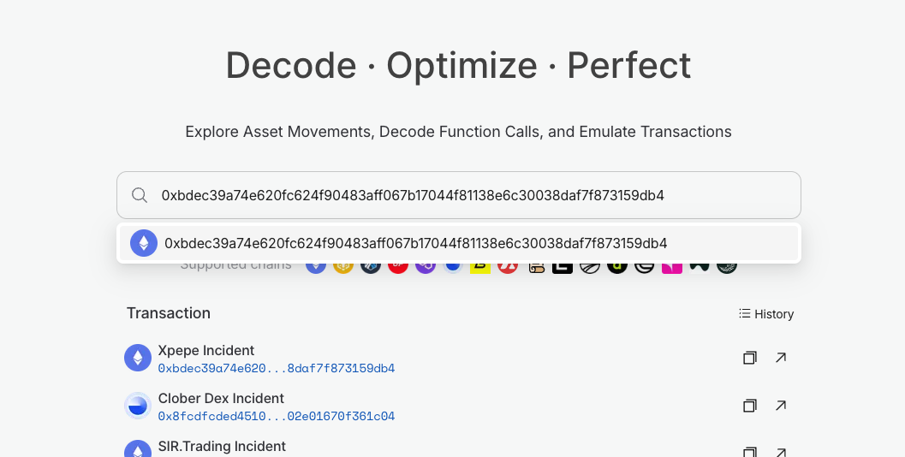

### Method 2: Direct URL Navigation

For faster access, users can navigate directly by crafting a URL in the following format:
`https://skylens.certik.com/tx/{chain}/{tx_hash}`.

* **Example (Ethereum)**: https://skylens.certik.com/tx/eth/0x1c27c4d625429acfc0f97e466eda725fd09ebdc77550e529ba4cbdbc33beb97b
* **Example (Base)**: https://skylens.certik.com/tx/base/0x190a491c0ef095d5447d6d813dc8e2ec11a5710e189771c24527393a2beb05ac

## The Analysis Page

Upon loading a transaction, Skylens presents the static analysis dashboard. This view provides a complete, high-level summary of the transaction before any interactive debugging.

Key Components:
* A. Primary Controls: A set of buttons, typically at the top of the interface, labeled "Debug", "Emulate", and "Ask AI". These controls are used to launch the interactive features.
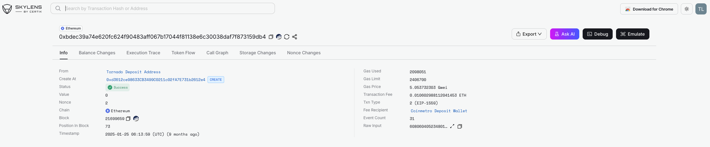
* B. Core Analysis Tabs: A tabbed-navigation panel that organizes all transaction data:
  * **Info**: General transaction data (From, To, Status, Value, Nonce).
  * **Balance Changes**: A ledger of all native token (ETH, BNB) transfers.
  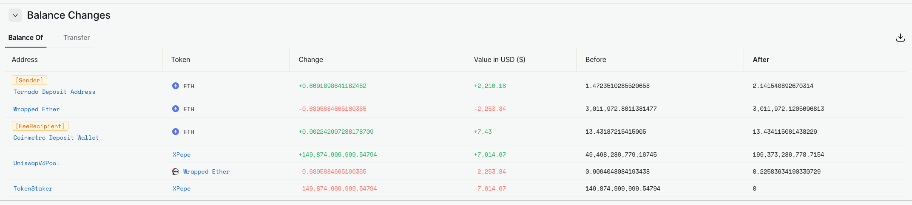
  * **Execution Trace**: The complete, flat execution trace, showing all opcodes, gas cost, and any sub-calls. This is the raw data used by the "Debug" feature.
  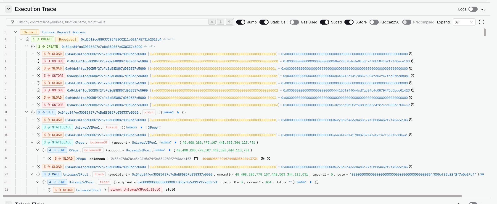
  * **Token Flow**: A dedicated ledger for all ERC-20, ERC-721, and ERC-1155 token transfers.
  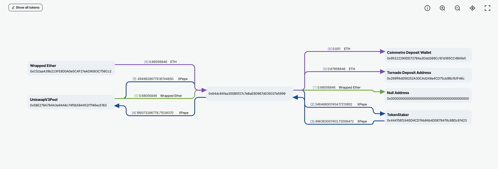
  * **Call Graph**: A visual, hierarchical graph of the transaction's call stack.
  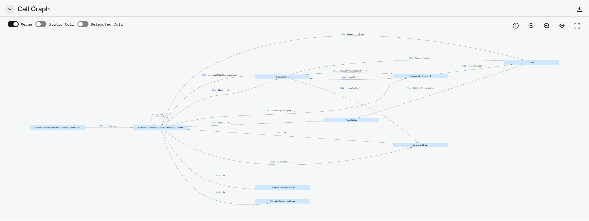
  * **Storage Changes**: A "diff" view (before/after) of all modified storage slots.
  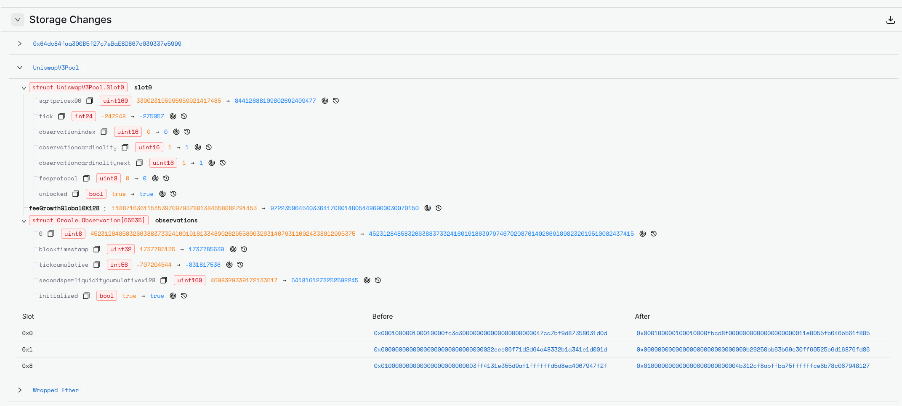
  * **Nonce Changes**: A specific view tracking any changes to account nonces.

## Walkthrough 2: Interactive Debugging (Forensics)

This walkthrough focuses on the "Debug" button and provides step-by-step execution analysis.
This mode is used for forensic analysis of a historical transaction.

* After loading a transaction (Walkthrough 1), click the "Debug" button.
* The interface will re-configure for interactive analysis. The "Execution Trace" panel becomes the central focus, with a "step" cursor highlighting the first opcode.
* Step Controls: Use the execution controls to advance the transaction.
  * **Step**: Execute the current opcode and stop at the next one.
  * **Step Over**: Execute the current opcode. If it is a `CALL`, `CALLCODE`, `DELEGATECALL`, or `STATICCALL`, the debugger will execute the entire sub-call and stop at the next opcode in the current context.
  * **Step Into**: Execute the current opcode. If it is a `CALL` or similar, the debugger will enter the sub-call and stop at its first opcode.
  * **Observe State**: As you step through each opcode, watch the "Stack," "Memory," and "Storage" panels update in real-time. This allows you to see exactly what data is being used for computations, checks, and external calls.

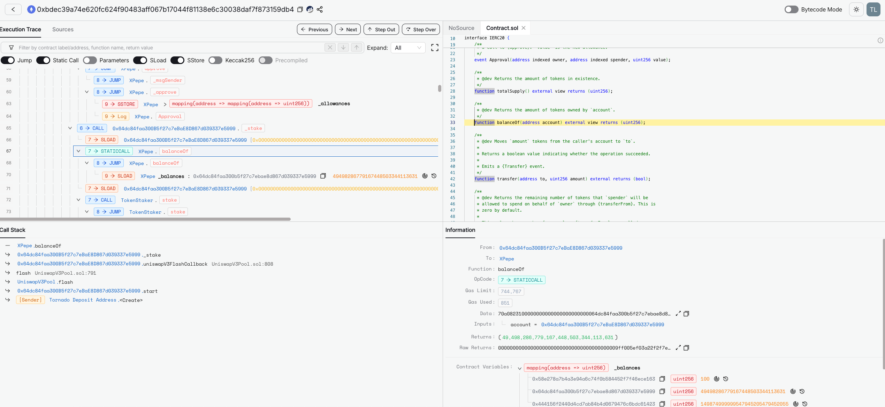

### Using the Bytecode Debugger

* Click the "Bytecode Mode" button at the top right of the debugger page to open the bytecode debugger.
* The bytecode debugger has two additional panels:
  * Bytecode: The **disassembled bytecode** of the contract currently being executed, as well as all contracts included in this transaction.
  * Data: The **Stack** / **Memory** / **Storage** of the current opcode.
* Locate the opcode:
  * **By selecting the event**: When selecting an event in the "Execution Trace" panel, the bytecode debugger will automatically locate the opcode in the bytecode.
  * **By Previous/Next buttons**: When clicking the "Previous" or "Next" button, the bytecode debugger will automatically locate the opcode in the bytecode.

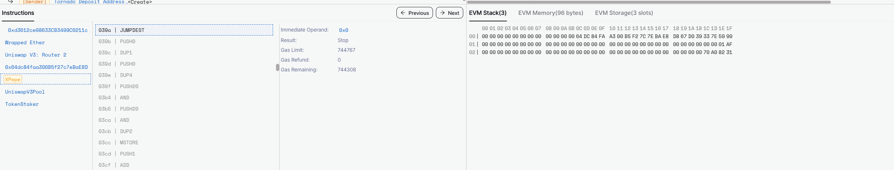
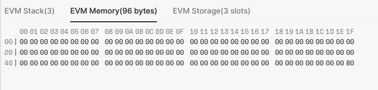
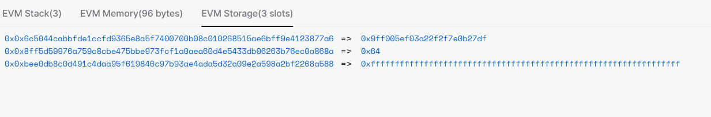

### Modifying the Data During Execution

Skylens allows you to modify the data in **stack** / **memory** / **storage** during execution.
When data is modified, Skylens will re-execute the transaction with the modified data,
and then show the new execution trace.

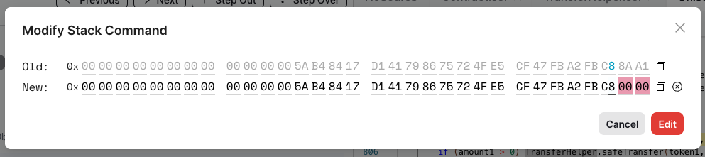

After modification, the data will be updated in the "Stack" / "Memory" / "Storage" panels.

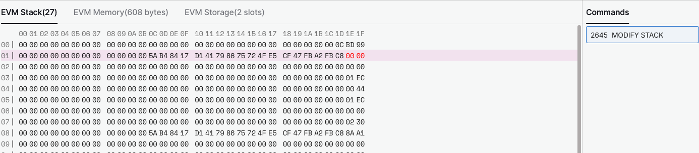

Also, the execution trace will be updated to reflect the changes:

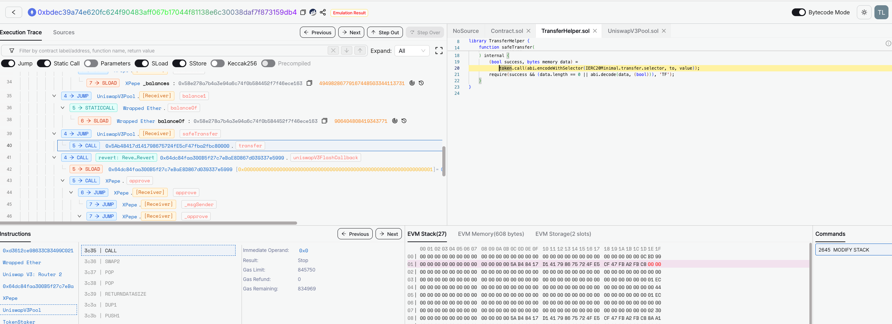

## Walkthrough 3: Storage Layout Inspector

Skylens **Storage Inspector** lets users decode on-chain state variables by reading contract storage slots.
Recent updates greatly enhance its capabilities:

* **Arrays & Mappings**: Skylens now fully supports dynamic types. The decoded storage view shows individual array elements and mapping key-value entries. For example, a Solidity mapping stores each (key, baseSlot) hashed by keccak256 to find its slot. Skylens computes and displays these values. Likewise, fixed and dynamic arrays (including nested arrays and strings) are unpacked in the UI. In Solidity, dynamic types (mappings, nested mappings, arrays, nested arrays, etc.) are stored via hashing and special layout rules, and Skylens now automatically follows those rules so users can browse each element/key under the mapping or array name. [link](https://skylens.certik.com/address/eth/0xB8c77482e45F1F44dE1745F52C74426C631bDD52?content=storage_layout)
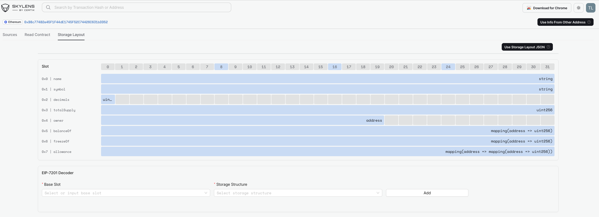
* **Historical State**: Users can view contract state **at any past block**. Skylens connects to archive-mode RPC endpoints, which maintain the complete record of the blockchain, allowing queries about any historical block state. In practice, the UI includes a block-height selector. Changing the block number causes Skylens to fetch the storage roots at that block and re-decode all variables. Thus you can rewind state and see what each variable was at any point in chain history. Also, the "clock" button beside the value provides a quick way to check how the state changes over time. The following shows the balance change of a holder. [link](https://skylens.certik.com/address/eth/0xB8c77482e45F1F44dE1745F52C74426C631bDD52?content=storage_layout)
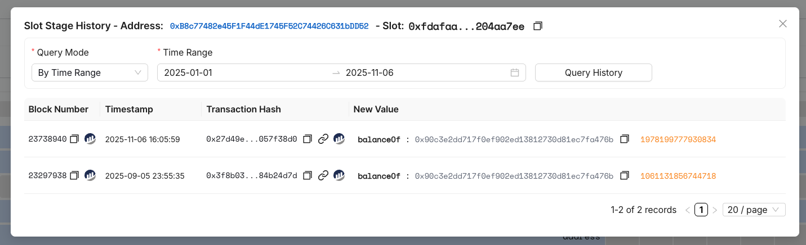
* **Proxy Detection & Resolution**: Skylens automatically recognizes common proxy patterns (Transparent proxy, UUPS, Beacon, etc.). Skylens checks known admin/implementation slots (e.g. the EIP-1967 slot or OpenZeppelin UUPS slot) and, if found, it fetches the implementation's bytecode and (if verified) its storage layout. The UI will show that the address is a proxy and list the implementation address. Then the decoded storage view reflects the variables of the underlying logic contract. In other words, all variables of an upgradable contract are shown from the implementation's schema, but the data comes from the proxy's storage. (For instance, a Transparent proxy stores its implementation address at a specific slot, and Skylens reads that so it can display the logic contract's variables.) [link](https://skylens.certik.com/address/eth/0xa0b86991c6218b36c1d19d4a2e9eb0ce3606eb48?content=storage_layout)
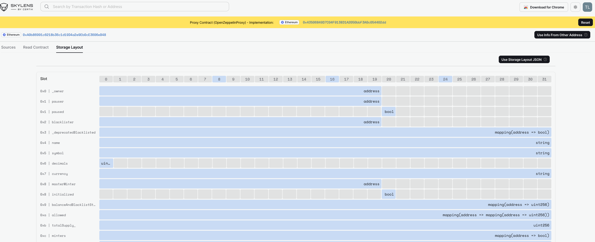
* **Custom Storage Layout Upload**: For contracts lacking verified source, users can supply their own layout. The Skylens interface includes an "Upload Storage Layout" button in the storage panel. Clicking it opens a file chooser where you can load a JSON file describing the contract's variable names, types, and slot positions (the same format output by Solidity compiler/Hardhat). Once uploaded, Skylens uses that schema to label each storage slot. This is essential for "unverified" contracts - for example, if you have the official Hardhat storageLayout.json for a deployed contract, you can import it to see human-readable variable names.

## Other Interesting Features

### Ask AI

Skylens provides an "Ask AI" button in the debugger interface.
This feature is an AI-driven assistant that allows a user to get an explanation of the behavior of the transaction.
This allows the AI to provide security-specific context and identify potential risks.
The following shows the result of asking AI to explain [this transaction](https://skylens.certik.com/tx/eth/0xbdec39a74e620fc624f90483aff067b17044f81138e6c30038daf7f873159db4).

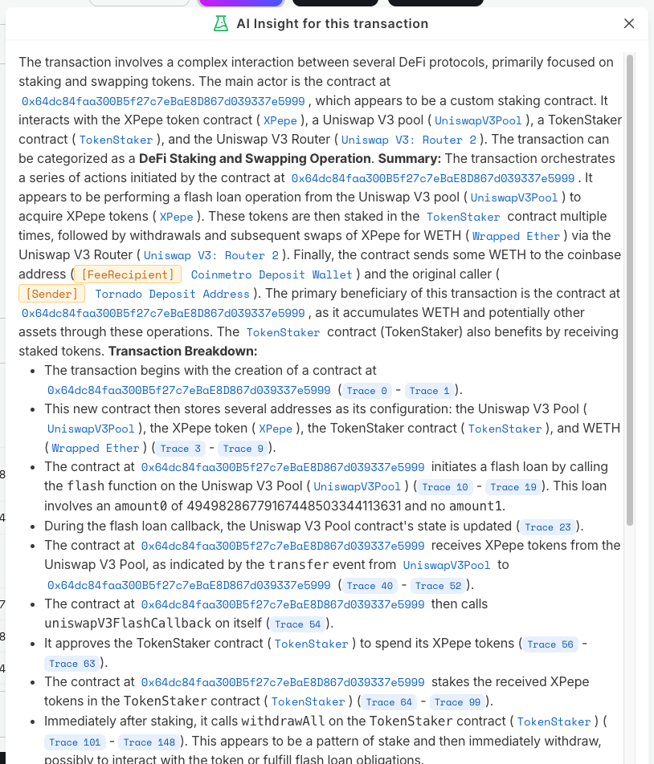

### Emulation

Skylens provides an "Emulation" button, which allows users to modify the parameters of the transaction and re-execute it.

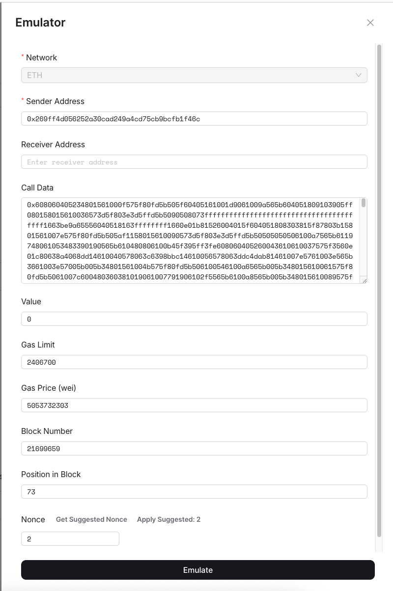

# Resources

* [Skylens](https://skylens.certik.com/)
* [Numa Incident Analysis By CertiK](https://www.certik.com/resources/blog/numa-incident-analysis)
* [GMX Incident Analysis By CertiK](https://www.certik.com/resources/blog/gmx-incident-analysis)
* [Bunni exploit analysis by QuillAudits](https://www.quillaudits.com/blog/hack-analysis/bunni-v2-exploit)

# LICENSE

Skylens follows the [MIT license](https://skylens.certik.com/LICENSE.txt).